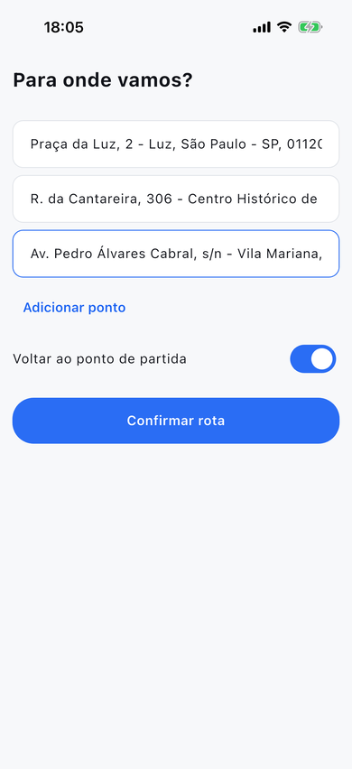
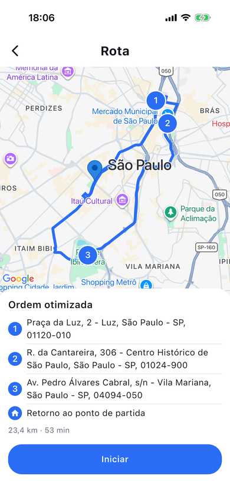
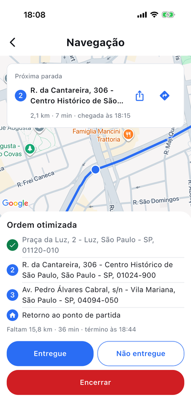
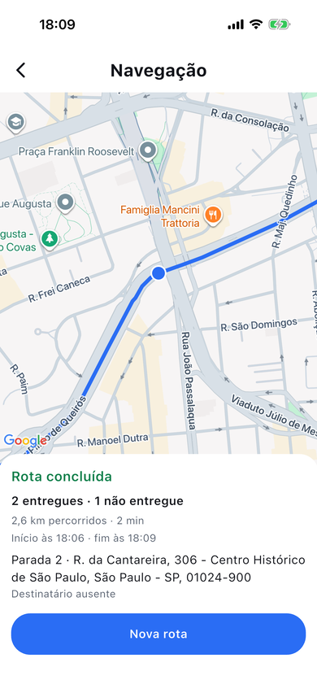
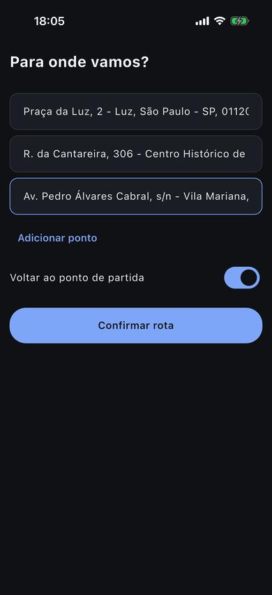
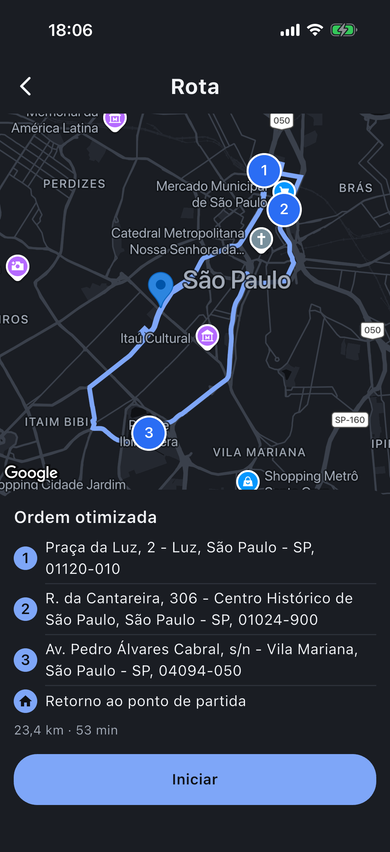
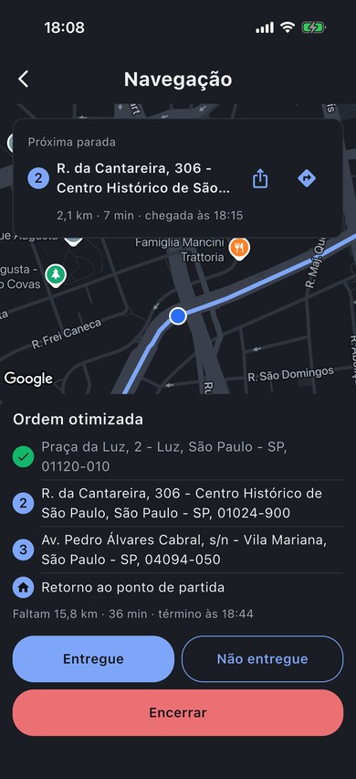
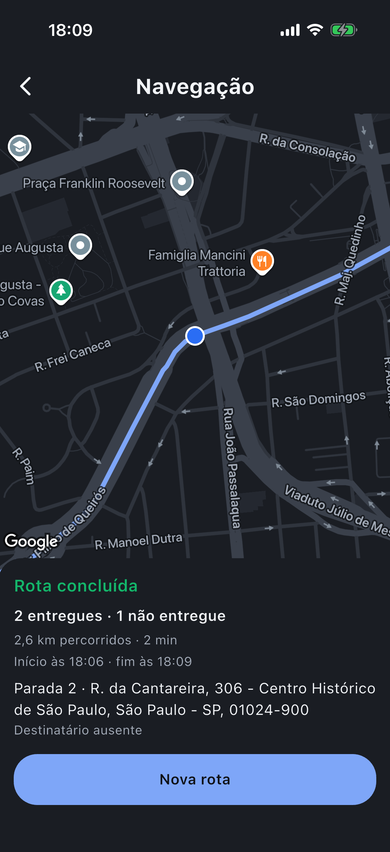
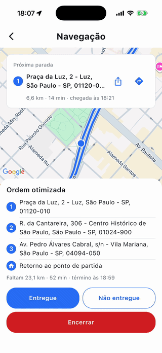

# RouteBreeze

App Flutter de roteirização de entregas: bloqueio biométrico, endereços com autocomplete, rota otimizada e navegação em tempo real com recálculo automático.


<p align="center">
  
  
  
  
</p>
<p align="center">
  
  
  
  
</p>
<p align="center"><sub>Uma ida e volta por três lugares públicos de São Paulo, nos temas claro e escuro, no simulador do iOS.</sub></p>

## Sobre

O RouteBreeze ajuda um entregador a visitar vários endereços na melhor ordem. O fluxo tem seis passos:

1. **Bloqueio.** O app abre pedindo biometria. Se não houver biometria cadastrada, usa o PIN, padrão ou senha do aparelho.
2. **Mapa.** Enquanto a posição e o mapa carregam, um loading com a marca e uma rota animada cobre a tela. Depois o mapa centraliza na posição atual (zoom 16) com o marcador "Partida". Esse é o ponto de origem da rota.
3. **Endereços.** O entregador digita três ou mais endereços e escolhe cada um na lista de sugestões do Google Places.
4. **Rota otimizada.** Uma única chamada à Routes API devolve a melhor ordem de visita. O app desenha a rota no mapa e numera as paradas de 1 a N.
5. **Navegação.** Ao tocar em "Iniciar", a posição é acompanhada em tempo real. A câmera segue o usuário, e um card no topo mostra a próxima parada com distância, tempo e horário de chegada, ou "Você chegou". O entregador registra cada parada como "Entregue" ou "Não entregue", com o motivo, e no fim vê um resumo da rota.
6. **Recálculo.** Se o entregador sai da rota, o app pede uma nova rota pelas paradas que faltam e mostra o aviso "Rota recalculada".

Feito com Flutter 3.47.5 e o design system **Rota** (tokens em `lib/core/theme/rb_tokens.dart`). Interface em português do Brasil. O projeto foi desenvolvido para a etapa técnica de um processo seletivo de desenvolvedor(a) Flutter, a partir de um enunciado e de um design system fornecidos.

## Depois da entrega

A versão entregue no processo seletivo é a tag [`v0.1.0`](https://github.com/Sancho18/routebreeze/releases/tag/v0.1.0). O que veio depois é evolução do projeto, uma branch `feature/*` por funcionalidade, com pull request para `develop`:

- **Progresso até a próxima parada** (`feature/live-progress`). Durante a navegação, um card "Próxima parada" mostra o número e o endereço da parada e quanto falta até ela ("1,2 km · 4 min · chegada às 14:32"). O painel da rota troca os totais pelo que falta até o fim ("Faltam 8,4 km · 22 min · término às 15:10"). Tudo sai da resposta da Routes API que o app já pedia, sem chamada extra. Detalhes em "Progresso até a próxima parada", nas decisões técnicas. Na mesma branch, o mapa passou a respeitar o espaço do painel e do card (antes, a posição do entregador e o logo do Google ficavam atrás do painel), e o fluxo foi validado no simulador do iOS.
- **Abrir a próxima parada no Google Maps ou no Waze** (`feature/open-in-maps`). Um botão no card da próxima parada abre "Abrir em outro app", com Google Maps e Waze. O RouteBreeze continua acompanhando a rota e, na volta, não pede o desbloqueio de novo (há uma navegação ativa). Detalhes em "Abrir em outro app", nas decisões técnicas.
- **Ícone, nome e abertura** (`feature/app-icon`). O app ganhou ícone próprio (a rota do loading, com a partida e a chegada, em branco sobre o azul `brand`), o nome "RouteBreeze" embaixo dele e uma tela de abertura na cor da tela de bloqueio. Detalhes em "Ícone e abertura", nas decisões técnicas.
- **Tema escuro** (`feature/dark-theme`). O app segue o tema do aparelho. A paleta escura estende o DS Rota sem mudar os valores do claro, todo par de texto e fundo passa de 4,5:1, e o mapa, as barras do sistema e a abertura acompanham o tema. Detalhes em "Tema escuro", nas decisões técnicas.
- **Acessibilidade** (`feature/accessibility`). Todo texto passa de 4,5:1 nos dois temas, todo controle tem área de toque de pelo menos 48 dp e um rótulo, as telas cabem com o texto do sistema em 200 % e o leitor de tela lê o card da próxima parada numa frase só. Um grupo de testes em cada tela confere isso. Detalhes em "Acessibilidade", nas decisões técnicas.
- **Resultado da entrega e resumo da rota** (`feature/delivery-outcome`). O entregador registra cada parada como "Entregue" ou "Não entregue", com o motivo ("Destinatário ausente", "Endereço não encontrado", "Recusado" ou "Outro"). Chegar à parada só mostra "Você chegou" no card: nada é registrado sem um toque. No fim, um resumo mostra as entregas, as paradas não entregues com o motivo, a distância percorrida, o tempo total e os horários de início e fim. Resultados, distância e início ficam salvos com a rota. Detalhes em "Resultado da entrega e resumo", nas decisões técnicas.
- **Avisar o cliente** (`feature/notify-customer`). Um botão "Avisar cliente" no card da próxima parada abre a folha de compartilhamento do sistema com uma mensagem pronta e o horário de chegada que o card mostra ("Olá! Sua entrega chega por volta das 14:32."). O entregador escolhe o app (WhatsApp, SMS) e o contato ali; o app não pede permissão nem guarda telefone. Detalhes em "Avisar o cliente", nas decisões técnicas.
- **Ida e volta** (`feature/round-trip`). Com "Voltar ao ponto de partida" ligado em Endereços, a rota termina na partida: a ordem de todas as paradas já conta com a volta, e a lista, os totais e a navegação mostram o retorno. Depois da última parada, o card "Retorno" guia de volta, e a rota termina ao chegar à partida ou em "Finalizar rota". O app lembra a escolha. Detalhes em "Ida e volta", nas decisões técnicas.
- **Acompanhamento em segundo plano** (`feature/background-tracking`). Durante a navegação, o app continua acompanhando a rota com a tela bloqueada ou com outro app na frente, como o Waze aberto por "Abrir em outro app": chegada, desvio, recálculo e progresso seguem funcionando. No Android, uma notificação fixa fica no painel enquanto a navegação dura (no Android 13 ou mais novo, só com a permissão de notificação); no iOS, aparece o indicador de localização do sistema. A permissão continua a de localização durante o uso, nunca "sempre". Detalhes em "Bateria e GPS", nas decisões técnicas.
- **Notificações** (`feature/notifications`). No Android, a notificação fixa da navegação mostra a próxima parada e quanto falta até ela ("Próxima parada 2 · Rua Augusta, 500" e "1,2 km · 4 min · chegada às 14:32"). Com o app em segundo plano, nas duas plataformas, avisos contam a chegada à parada, o recálculo e o fim da rota, e somem quando o app volta. A permissão de notificação é pedida no primeiro "Iniciar", e a navegação começa com ou sem ela. Detalhes em "Notificações", nas decisões técnicas.

## Demonstração

<p align="center">
  
</p>

Vídeo do fluxo completo, gravado no aparelho com o build de release (Samsung Galaxy A71, Android 13): [assistir no Google Drive](https://drive.google.com/file/d/18EI1BpJeX7N34w6d5pvXB7j8HmA2pIkz/view?usp=sharing).

APK de release (Android): [Release v0.1.0](https://github.com/Sancho18/routebreeze/releases/tag/v0.1.0), arquivo `app-release.apk`. Esse APK já sai com uma chave de teste embutida (restrita às APIs que o app usa), então dá para instalar com `adb install app-release.apk` e testar sem configurar nada. Para rodar a partir do código, veja "Configuração da chave do Google".

## Requisitos

- Flutter 3.47.5 (canal stable), que traz o Dart 3.13
- Android SDK e um aparelho ou emulador Android
- Xcode (opcional, só para compilar o iOS)
- Uma chave do Google Cloud com as quatro APIs da seção abaixo

## Configuração da chave do Google

### APIs a ativar no projeto Google Cloud

- Maps SDK for Android
- Maps SDK for iOS
- Places API (New)
- Routes API

### Registrar a chave

Opção 1, pelo script (na raiz do projeto). Sem argumento ele pede a chave sem ecoar, para ela não ficar no histórico do shell:

```bash
tool/set_api_key.sh
```

O script escreve dois arquivos ignorados pelo Git (modo 600):

- `env.json` com `{"GOOGLE_MAPS_API_KEY": "SUA_CHAVE"}`
- `ios/Flutter/Secrets.xcconfig` com `GOOGLE_MAPS_API_KEY=SUA_CHAVE`

Opção 2, manual: copie `env.example.json` para `env.json` e troque o valor. Para o iOS, crie `ios/Flutter/Secrets.xcconfig` com a linha `GOOGLE_MAPS_API_KEY=SUA_CHAVE`.

### Como a chave chega em cada lugar

- **Dart.** `--dart-define-from-file=env.json` preenche `Env.googleMapsApiKey` (`lib/core/config/env.dart`). O `Dio` envia a chave no header `X-Goog-Api-Key` das chamadas REST a Places e Routes.
- **Android.** `android/app/build.gradle.kts` lê `env.json` no build e injeta o valor no `AndroidManifest.xml` (`com.google.android.geo.API_KEY`) por um placeholder de manifest.
- **iOS.** `Secrets.xcconfig` é incluído pelos xcconfig do Flutter. O `Info.plist` expõe `GMSApiKey` e o `AppDelegate` chama `GMSServices.provideAPIKey`.

### Por que a chave não está no Git

`env.json` e `ios/Flutter/Secrets.xcconfig` estão no `.gitignore`. Só `env.example.json` é versionado. Assim o repositório pode ser público sem expor a chave, e cada pessoa compila com a sua.

Sem `env.json` o app falha ao abrir com uma mensagem que aponta para o arquivo. `flutter analyze` e `flutter test` não precisam da chave.

### Para quem for avaliar

Use a sua própria chave (com as quatro APIs ativadas) ou a chave que envio em separado. Nos dois casos basta rodar `tool/set_api_key.sh SUA_CHAVE` e seguir para "Como rodar".

## Como rodar

```bash
flutter pub get
flutter run --dart-define-from-file=env.json
```

No VS Code, use a configuração **RouteBreeze (debug, env.json)** de `.vscode/launch.json`, que já passa o `--dart-define-from-file`. Sem esse argumento o app para na checagem da chave antes de abrir a primeira tela.

Recomendo um aparelho físico: biometria e GPS de verdade. No emulador Android dá para cadastrar uma digital nas configurações e simular a posição pelos "Extended controls > Location".

## Build

APK de release:

```bash
flutter build apk --release --dart-define-from-file=env.json
```

Saída: `build/app/outputs/flutter-apk/app-release.apk` (cerca de 53 MB, com as três ABIs: arm64-v8a, armeabi-v7a e x86_64). Para um APK menor por arquitetura, acrescente `--split-per-abi`. O build leva pouco mais de um minuto em um Mac com o Gradle já aquecido.

Instalação no aparelho: `adb install build/app/outputs/flutter-apk/app-release.apk`. A pasta `build/` está no `.gitignore`; o APK vai para a página de Releases, não para o repositório.

O build de release usa a assinatura de debug (`signingConfig = debug` em `android/app/build.gradle.kts`). Isso basta para instalar e testar. Para publicar na loja seria preciso um keystore próprio.

iOS: `flutter build ios --no-codesign` compila com as permissões e a chave configuradas. Depois da entrega rodei o fluxo completo no simulador (iPhone 17 Pro, iOS 26.5), com as APIs do Google de verdade. No simulador, o Face ID e o GPS podem ser simulados pela linha de comando:

```bash
xcrun simctl spawn booted notifyutil -s com.apple.BiometricKit.enrollmentChanged '1'
xcrun simctl spawn booted notifyutil -p com.apple.BiometricKit.enrollmentChanged
xcrun simctl spawn booted notifyutil -p com.apple.BiometricKit_Sim.pearl.match
xcrun simctl location booted set -23.5645,-46.6527
```

As duas primeiras linhas cadastram um rosto, a terceira reconhece o rosto quando o app pede o Face ID e a última fixa a posição na Av. Paulista. `xcrun simctl location booted start --speed=25 -` lê pontos `lat,lng` da entrada padrão e percorre o caminho, o que serve para ver a navegação andando. Não testei num iPhone físico.

Acompanhamento em segundo plano e notificações no Android: os testes conferem as chamadas ao foreground service e aos avisos e as configurações do stream de posição, e o resto se confere num aparelho. O APK da v0.1.0 (em "Demonstração") é anterior a essas funcionalidades. Compile o APK de release a partir deste código (branch `feature/notifications` em diante) e instale:

```bash
flutter build apk --release --dart-define-from-file=env.json
adb install build/app/outputs/flutter-apk/app-release.apk
```

Esse APK é assinado com a chave de debug da máquina que compila (veja acima), e o Android não atualiza um app instalado com outra assinatura. Se o aparelho tiver um RouteBreeze assinado por outra máquina, como o APK da v0.1.0 para quem não o compilou, desinstale-o antes com `adb uninstall com.viniciusrocha.routebreeze`. A rota salva vai junto.

No Android 13 ou mais novo, o primeiro "Iniciar" depois da instalação pede a permissão de notificação. Permita para ver a notificação da navegação e os avisos. A navegação começa depois da resposta, qualquer que seja, e o app não pergunta de novo.

1. Calcule uma rota, toque em "Iniciar", permita as notificações e bloqueie a tela. A notificação da navegação fica no painel com a próxima parada ("Próxima parada 1 · …") e a distância, o tempo e a chegada do card.
2. Com a tela bloqueada, ande até a próxima parada. Chega o aviso "Você chegou à parada 1", com o endereço e "Registre a entrega.", e a notificação da navegação passa a "Você chegou".
3. Desbloqueie: o card mostra "Você chegou", e o aviso some.
4. Abra outro app, espere 30 s ou mais e toque na notificação: o RouteBreeze volta na tela de navegação, sem a tela de bloqueio.
5. Toque em "Entregue": a notificação da navegação passa na hora para a parada seguinte. Ande com a tela bloqueada: a distância e a chegada mudam no máximo a cada 15 s.
6. Com a tela bloqueada, saia da rota por mais de 50 m: chega o aviso "Rota recalculada", com a próxima parada.
7. Toque em "Encerrar": a notificação some.
8. Numa ida e volta, depois da última parada, bloqueie a tela e volte à partida: chega o aviso "Rota concluída", com as contagens ("3 entregues · 1 não entregue"). Ao desbloquear, o resumo está na tela.
9. Desinstale e instale de novo, e negue a permissão no primeiro "Iniciar": a navegação começa do mesmo jeito, sem notificação no painel. Repita os passos 1 a 3: a caminhada com a tela bloqueada ainda termina em "Você chegou", sem aviso. O próximo "Iniciar" não pergunta de novo.

## Testes e qualidade

```bash
flutter analyze
flutter test
dart format --set-exit-if-changed lib test
```

São 1067 testes de unidade, Cubit (`bloc_test`) e widget em `test/`, espelhando a árvore de `lib/`; `test/tool/` confere as imagens da marca e `test/platform/` os arquivos de Android e iOS: os gerados (ícones, nome e abertura); em `permissions_test.dart`, as permissões do Android, com as do foreground service de localização e a de notificação, e as descrições de uso do iOS, fixadas no conjunto de hoje; e, em `background_location_test.dart`, o foreground service de localização no manifesto do Android, o `res/raw/keep.xml` que mantém o ícone da notificação no build de release e o `UIBackgroundModes` do iOS. Esses testes leem o manifesto do app; no APK, o manifesto do plugin de notificações acrescenta `VIBRATE`. O teste de cada tela tem um grupo de acessibilidade: contraste, alvos de toque e texto em 200 % (veja "Acessibilidade"). Regras de domínio testam os valores exatos (50 m, 3 fixes, 30 m, 20 s, 40 m, 300 ms, 3 caracteres, 15 s). `test/app_flow_test.dart` percorre as rotas nomeadas de ponta a ponta com Cubits reais e serviços falsos (desbloqueio, ponto de partida, três endereços, rota otimizada, navegação e "Encerrar"; o pedido da permissão de notificação no primeiro "Iniciar", antes da navegação, e a notificação da navegação com a parada e os horários do card; a ida e volta, com o pedido que termina na partida, o interruptor lembrado depois de um reinício e o card "Retorno" até o resumo de "Finalizar rota"; com a navegação no relógio do teste, os resultados com um reinício do app no meio, a chegada e o resumo até "Nova rota"); os `GoogleMap` padrão das telas são montados com um dublê dos canais de plataforma (`test/helpers/fake_google_map.dart`), o que permite verificar zoom, marcadores e movimentos de câmera.

### Cobertura

```bash
flutter test --coverage
python3 tool/coverage_report.py   # lê coverage/lcov.info (só stdlib)
```

O script agrega linhas por pasta, lista os arquivos abaixo de 90 % e imprime dois totais: todos os arquivos e sem os arquivos *native-only* (código que só executa num aparelho, hoje apenas `lib/main.dart`: `configureDependencies()` e `runApp()` após a checagem da chave). Sai com código 1 quando alguma pasta ou o total fica abaixo de 90 %.

| Pasta | Linhas | Cobertas | % |
| --- | ---: | ---: | ---: |
| lib/core | 464 | 464 | 100,0 % |
| lib (raiz: `app.dart`, `main.dart`) | 82 | 80 | 97,6 % |
| lib/features/addresses | 349 | 347 | 99,4 % |
| lib/features/location | 207 | 207 | 100,0 % |
| lib/features/lock | 77 | 77 | 100,0 % |
| lib/features/navigation | 897 | 894 | 99,7 % |
| lib/features/route | 590 | 588 | 99,7 % |
| **Total (todos os arquivos)** | 2666 | 2657 | 99,7 % |
| **Total (sem native-only)** | 2661 | 2654 | 99,7 % |

`test/coverage_helper_test.dart` importa todos os arquivos de `lib/` para que o `lcov.info` liste inclusive os que nenhum teste carregaria. As linhas restantes são `stringify`/`props` de objetos de valor nunca comparados por igualdade nos testes e as duas linhas nativas de `main.dart`.

Teste de integração (precisa de um aparelho ou do simulador do iOS; usa fakes para biometria, GPS, a permissão de notificação e Google APIs). Vai do desbloqueio à rota otimizada e, na navegação, passa pela chegada ("Você chegou"), por "Entregue", por "Não entregue" com um motivo e pelo resumo:

```bash
flutter test integration_test -d <deviceId> --dart-define-from-file=env.json
```

CI: o workflow `.github/workflows/ci.yml` roda no GitHub Actions a cada push e pull request para `main` e `develop`, com Flutter 3.47.5 stable: `flutter pub get`, `dart format --set-exit-if-changed lib test`, `flutter analyze` e `flutter test`.

## Arquitetura

Feature-first, com três camadas por feature:

- `data`: APIs REST, plugins nativos e storage (implementa as interfaces do domínio)
- `domain`: modelos, interfaces e regras puras (sem Flutter nem I/O)
- `presentation`: Cubits e telas

Estado com `flutter_bloc` (Cubit). Injeção de dependência com `get_it`, montada em `lib/core/di/injector.dart`. As telas aceitam o Cubit e os serviços por parâmetro (usado nos testes); em produção vêm do `get_it`.

```
lib/
  main.dart                      binding, checagem da chave, DI, runApp
  app.dart                       MaterialApp, tema, rotas nomeadas, AppLifecycleGate
  core/
    config/env.dart              chave via --dart-define
    di/injector.dart             composição do get_it
    error/failure.dart           Failure (NoConnection, ApiFailure...)
    geo/                         GeoPoint, GeoMath (haversine, ponto-segmento), PolylineCodec
    network/                     Dio (chave, timeouts, retry) e ConnectivityService
    session/session_state.dart   navegação ativa + hooks de pause/resume
    theme/                       RbTokens (DS Rota), RbPalette (clara e escura), RbTheme,
                                 estilo escuro do mapa e barras do sistema
    widgets/                     RbPrimaryButton, RbSecondaryButton, RbTextField, RbBanner,
                                 RbStatusChip, RbInlineError
  features/
    lock/         data: LocalAuthService (local_auth)
                  domain: AuthResult, RelockPolicy
                  presentation: LockCubit, LockScreen
    location/     data: GeolocatorLocationService
                  domain: LocationService, Fix
                  presentation: MapCubit, MapScreen
    addresses/    data: PlacesApi (autocomplete + details), RoundTripPreference (shared_preferences)
                  domain: Stop, Suggestion, AddressField, AddressFormValidator
                  presentation: AddressFormCubit, AddressesScreen, AddressFieldWidget
    route/        data: RoutesApi, RouteStorage (shared_preferences)
                  domain: RoutePlan, StopResult, RoutePlanner, RouteRepository
                  presentation: RouteCubit, RouteScreen, RouteSheet, StopBadge, MapMarkers
    navigation/   data: NavigationAppLauncher (url_launcher), CustomerNotifier (share_plus),
                        BackgroundTracker, NotificationPermission, RouteAlerts
                        (flutter_local_notifications)
                  domain: DeviationDetector, ArrivalDetector, RecalcPolicy, ProgressEstimator,
                          NavigationApp, Odometer, RouteSummary
                  presentation: NavigationCubit, NavigationNotifier, NavigationScreen,
                                NextStopCard, OpenInAppSheet, FailureReasonSheet,
                                RouteSummarySheet, ReturnCard, customerMessage,
                                textos das notificações
test/            espelha lib/ (unidade, bloc_test, widget)
integration_test/ fluxo principal com fakes, roda no aparelho
tool/            set_api_key.sh, coverage_report.py, brand/ (ícone e abertura)
assets/brand/    imagens de origem do ícone e da abertura
docs/            decisions.md
```

Fluxo de telas: `/lock` → `/map` → `/addresses` → `/route` → `/navigation`. O `AppLifecycleGate` (em `app.dart`) observa o ciclo de vida: rebloqueia ao voltar do segundo plano e avisa a navegação quando o app sai da tela e quando volta. Antes de "Iniciar", a navegação pausa e retoma o stream de posição; depois, continua acompanhando em segundo plano (veja "Bateria e GPS").

Onde ficam as regras puras (todas com teste de unidade):

- `AddressFormValidator`: campo obrigatório, sugestão selecionada, endereço repetido.
- `RoutePlanner`: escolhe o destino (o ponto mais distante numa rota só de ida, a partida numa ida e volta) e monta a ordem final a partir de `optimizedIntermediateWaypointIndex`.
- `DeviationDetector`: saída da rota (50 m, 3 fixes, precisão ≤ 30 m).
- `ProgressEstimator`: distância, tempo e chegada até a próxima parada e até o fim.
- `ArrivalDetector`: chegada a uma parada ou à partida de uma ida e volta (40 m).
- `Odometer`: distância percorrida (segmentos entre fixes com precisão ≤ 30 m).
- `RouteSummary`: contagens, paradas não entregues e duração do resumo.
- `RecalcPolicy`: intervalo mínimo, uma requisição por vez, adiamento offline.
- `RelockPolicy`: rebloqueio após 30 s em segundo plano.
- `GeoMath` e `PolylineCodec`: distâncias e decodificação da polyline.

## Decisões técnicas

Resumo abaixo. Cada decisão está detalhada em formato ADR em [`docs/decisions.md`](docs/decisions.md).

### Routes API em vez de Directions API

A Directions API é legada. A Routes API (`computeRoutes`) aceita `optimizeWaypointOrder`, devolve `optimizedIntermediateWaypointIndex` e usa field mask, o que limita o que é cobrado. O app pede só `duration`, `distanceMeters`, `legs.polyline.encodedPolyline`, `legs.distanceMeters`, `legs.duration` e o índice otimizado. A linha da rota é a junção das polylines dos trechos (a documentação diz que a polyline da rota é essa combinação, e numa resposta real as duas têm os mesmos 115 pontos), o que também diz onde cada trecho termina. É uma requisição por cálculo, com `travelMode: DRIVE`. Com `optimizeWaypointOrder`, a chamada é cobrada na SKU Compute Routes Pro.

### Destino = ponto mais distante da origem

A Routes API exige um destino fixo e só reordena os pontos intermediários. Numa rota só de ida, escolho como destino a parada sem resultado mais distante da origem (em linha reta). As demais viram intermediários com otimização ligada. O ponto mais distante costuma ser o fim natural de uma rota de entregas, e a regra mantém uma requisição por cálculo. A mesma regra vale no recálculo, sobre as paradas que faltam. Numa ida e volta o destino é a partida, e todas as paradas são otimizadas (veja "Ida e volta").

Limite: numa rota só de ida, a ordem pode não ser a ótima global quando o melhor ponto final não é o mais distante. A alternativa exata seria fazer N requisições (uma com cada parada como destino) e ficar com a de menor duração. Custa N vezes mais chamadas para um ganho pequeno em rotas de bairro, então ficou de fora.

### Places API (New) com session tokens e field mask enxuta

Autocomplete: mínimo de 3 caracteres, debounce de 300 ms, no máximo 5 sugestões, `locationBias` circular de 50 km ao redor da partida, `includedRegionCodes: br` e `languageCode: pt-BR`. Cada campo tem o seu session token. O Place Details usa o mesmo token e a field mask `id,formattedAddress,location` (SKU Essentials), o que fecha a sessão. Depois da seleção o campo recebe um token novo. Resultado: um Place Details por endereço escolhido e autocomplete só depois do debounce. O bias é só uma dica: endereços a mais de 50 km continuam válidos.

### Limiares de desvio, chegada e recálculo

- **Fora da rota:** 3 fixes consecutivos a mais de 50 m da polyline, contando só fixes com precisão ≤ 30 m. Um fix repetido (mesmo timestamp) conta uma vez.
- **Recálculo:** no mínimo 20 s entre dois recálculos e um por vez. Só as paradas sem resultado entram, com a mesma regra de destino. Com a resposta, a polyline é trocada, as paradas renumeradas e o aviso "Rota recalculada" fica 4 s na tela.
- **Chegada:** um fix com precisão ≤ 50 m a até 40 m da próxima parada mostra "Você chegou" no card. A parada só avança quando o entregador registra o resultado, "Entregue" ou "Não entregue", o que funciona a qualquer momento da navegação e serve para demonstrar sem ir até o local (veja "Resultado da entrega e resumo").
- **Qualidade do GPS:** "Iniciar" só habilita quando o último fix tem precisão ≤ 50 m; antes disso aparece "Aguardando sinal de GPS". No mapa inicial, a partida precisa de um fix com precisão ≤ 50 m em até 15 s.

### Progresso até a próxima parada

- **Onde o entregador está.** A posição é projetada no segmento mais próximo do trecho (leg) que chega à próxima parada. Cada trecho sabe em que vértice da linha termina (`RouteLeg.endIndex`), então a projeção nunca cai num trecho que já passou ou que ainda não começou.
- **Quanto falta.** A distância e a duração que o Google deu para esse trecho são multiplicadas pela fração da linha que ainda falta nele. Os trechos seguintes entram inteiros, até a última parada sem resultado e, numa ida e volta, até a partida. Horário de chegada = relógio do aparelho + tempo que falta.
- **Quando mede.** A cada fix com precisão ≤ 50 m (o mesmo corte do "Iniciar"), a cada resultado registrado e depois de um recálculo. Um fix pior move o marcador, mas mantém a última medida.
- **Custo.** Nenhuma chamada a mais: pedir a polyline de cada trecho no lugar da polyline da rota não muda a SKU.

A regra fica em `ProgressEstimator` (Dart puro, testado com rotas sintéticas sobre o Equador, onde as distâncias são exatas).

### Abrir em outro app

- **Links universais.** Google Maps usa o formato Maps URLs (`https://www.google.com/maps/dir/?api=1&destination=<lat,lng>&destination_place_id=<id>&travelmode=driving&dir_action=navigate`); o Waze usa `https://waze.com/ul?ll=<lat,lng>&navigate=yes`. O sistema abre o app quando ele está instalado e o site quando não está, então não precisa de esquema próprio (`comgooglemaps://`, `waze://`), nem de `LSApplicationQueriesSchemes` no iOS, nem de `<queries>` no Android.
- **Destino.** Coordenadas com seis casas decimais (sem notação exponencial) e, no Google Maps, o `placeId` da parada, para o app mostrar o lugar certo.
- **Sem checar antes.** O app chama `launchUrl` direto e trata o `false` (ou um erro da plataforma) mostrando "Não foi possível abrir o <app>." no próprio sheet, que continua aberto para tentar o outro app. É o que a documentação do `url_launcher` recomenda no lugar de `canLaunchUrl`.
- **Com o outro app na frente.** O RouteBreeze continua acompanhando a rota em segundo plano (veja "Bateria e GPS"), e a legenda do sheet avisa isso: "O RouteBreeze continua acompanhando a rota em segundo plano.". Na volta, com a navegação ativa, não há rebloqueio.

### Avisar o cliente

- **Mensagem.** O botão "Avisar cliente" do card da próxima parada monta a mensagem com o estado da navegação: com a chegada medida, "Olá! Sua entrega chega por volta das 14:32.", com o mesmo horário do card; antes da primeira medida, "Olá! Sua entrega está a caminho."; depois de "Você chegou", "Olá! Cheguei com a sua entrega.".
- **Canal.** A folha de compartilhamento do sistema (`share_plus`): o entregador escolhe WhatsApp, SMS ou outro app e o contato ali. Sem SMS automático nem API paga, o app não precisa de backend, de permissão nem de guardar o telefone do cliente. Um teste fixa as permissões do Android e as descrições de uso do iOS no conjunto de hoje.
- **Folha.** Ela abre ancorada no botão, como o iPad exige; no iPhone e no Android sobe da parte de baixo. Se não abrir, a tela mostra "Não foi possível abrir o compartilhamento.".

### Ida e volta

- **Escolha.** O interruptor "Voltar ao ponto de partida" fica em Endereços, entre "Adicionar ponto" e "Confirmar rota". Na primeira vez vem desligado; depois, abre com a última escolha confirmada, também depois de reiniciar o app (chave `round_trip` nas `shared_preferences`).
- **Requisição.** Ligado, a partida vira o destino e todas as paradas viram intermediários, com `optimizeWaypointOrder`. Continua uma requisição por cálculo, e a ordem de todas as paradas já conta com a volta. A resposta traz um trecho a mais, da última parada até a partida, que a rota guarda como o trecho de volta. Desligado, vale a regra do ponto mais distante (veja a decisão acima).
- **Volta.** A lista termina em "Retorno ao ponto de partida", com uma casa no lugar do número, e os totais da rota e o "Faltam … · término às …" da navegação incluem a volta. Depois do resultado da última parada, o card "Retorno" mostra "Ponto de partida" com a distância, o tempo e o horário de chegada da volta; o leitor de tela o lê numa frase só ("Retorno ao ponto de partida. 3,2 km, 9 min, chegada às 15:40"). O botão "Abrir em outro app" do card passa a partida ao Google Maps ou ao Waze pelas coordenadas, e "Avisar cliente" sai, porque na volta não há cliente.
- **Fim.** Um fix com precisão ≤ 50 m a até 40 m da partida conclui a rota e mostra o resumo, como a chegada numa parada. Na volta, "Finalizar rota" (botão primário) toma o lugar de "Entregue" e "Não entregue" e conclui a rota sem precisar chegar. "Encerrar" fica embaixo dele e continua a última ação do painel: salva a rota e volta para a tela Rota, como no caminho até uma parada, e o voltar do sistema faz o mesmo. O resumo conta o tempo até a chegada ou o toque.
- **Recálculo.** Um desvio pede a rota da posição atual pelas paradas que faltam, ainda terminando na partida; na volta, sem parada nenhuma. A partida fica guardada à parte da origem, que o recálculo troca pela posição atual, então o destino e o pino de partida não andam com o entregador. Sem conexão, o recálculo fica pendente como no resto da rota.
- **Rota salva.** A partida e o trecho de volta ficam salvos com a rota. Uma rota salva antes desta versão continua só de ida.

### Resultado da entrega e resumo

- **Resultados.** "Entregue" (botão primário) e "Não entregue" (botão com contorno) ficam lado a lado acima de "Encerrar" e funcionam a qualquer momento da navegação, antes mesmo de chegar. "Não entregue" abre "Por que não foi entregue?" com "Destinatário ausente", "Endereço não encontrado", "Recusado" e "Outro"; fechar sem escolher não registra nada. O resultado vai para a próxima parada, com o horário, e a seguinte passa a ser a próxima. Na lista, a parada entregue ganha um check e a não entregue um "×", com o motivo embaixo do endereço. Cada resultado salva a rota; o último a conclui e apaga a rota salva, a não ser numa ida e volta, que segue até a partida. "Encerrar" volta para a tela Rota sem perder o progresso: a lista mostra os resultados, e "Iniciar" continua da próxima parada, com o mesmo início e a distância percorrida. O voltar do sistema faz o mesmo que "Encerrar" durante a rota e o mesmo que "Nova rota" no resumo; no iOS, o gesto de borda fica desligado nessa tela, e o botão de voltar da barra continua. Um resultado não muda depois de registrado.
- **Toque duplo.** Um toque em "Entregue", num motivo ou em "Finalizar rota" a menos de 1 s do resultado anterior é ignorado. Cada toque registra a próxima parada, então um toque duplo registraria duas. Numa ida e volta, depois do último resultado, "Finalizar rota" ocupa o lugar de "Entregue", e o segundo toque concluiria a rota.
- **Chegada.** Um fix com precisão ≤ 50 m a até 40 m da próxima parada troca a distância do card por "Você chegou". A parada continua a próxima até o resultado, mesmo que o entregador se afaste. Enquanto isso, o app não recalcula por desvio, porque para entregar ele pode sair da rua. Se uma resposta de recálculo trouxer outra parada como próxima, o "Você chegou" some. Um recálculo adiado sem conexão é descartado na chegada, junto com o aviso "Recálculo pendente (sem conexão)", e a volta da conexão não pede nada. Depois do resultado, a detecção de desvio recomeça.
- **Resumo.** O fim da rota troca o painel pelo resumo, nesta ordem: "Rota concluída", as contagens ("3 entregues · 1 não entregue"), a distância e o tempo ("12,4 km percorridos · 1 h 05 min"), os horários ("Início às 08:40 · fim às 09:45"), cada parada não entregue ("Parada 2 · Rua Augusta, 500", com o motivo embaixo) e "Nova rota", que abre o mapa sem rota salva. O início é o primeiro "Iniciar" da rota, mesmo numa rota continuada, e o fim é o último resultado (numa ida e volta, a chegada à partida ou "Finalizar rota"). Com o texto em 200 %, um resumo que não cabe abre em "Nova rota" e rola até o título.
- **Distância percorrida.** É a soma dos segmentos em linha reta entre fixes consecutivos com precisão ≤ 30 m, o mesmo corte da detecção de desvio. Um fix pior fica de fora, e o próximo fix bom liga ao último bom. Só conta durante a navegação: nada soma antes de "Iniciar". A distância fica na memória e vai para a rota salva a cada resultado, em "Encerrar" e quando o app vai para o segundo plano, nunca a cada fix. Uma rota continuada depois de um reinício retoma a distância salva.
- **Bloqueio com o resumo na tela.** A navegação conta como ativa até a tela de navegação fechar, também depois de concluída. Assim, voltar do segundo plano após 30 s ou mais com o resumo na tela não mostra o bloqueio: rebloquear limparia as telas, e o resumo se perderia, porque a rota salva já foi apagada.
- **Rotas salvas antes.** Uma parada salva como visitada, sem resultado, conta como entregue. Uma rota salva sem horário de início ganha o início no próximo "Iniciar", então o resumo sempre traz o tempo e os horários.

As regras do resumo e da distância ficam em `RouteSummary` e `Odometer` (Dart puro). O `NavigationCubit` guarda a chegada como estado, registra os resultados e monta o resumo.

### Offline: rota persistida e recálculo adiado

- Sem conexão, um banner "Sem conexão" aparece no topo da tela. Em Endereços, "Confirmar rota" desabilita e o autocomplete não é chamado, mas o texto digitado fica.
- A rota ativa (ordem, resultado de cada parada, polyline, totais, início e distância percorrida) é salva em `shared_preferences` ao ser calculada ou recalculada, em "Iniciar", a cada resultado, em "Encerrar" e quando o app vai para o segundo plano durante a navegação. É apagada ao concluir ou ao começar uma rota nova. Fica em texto puro, só na sandbox do app; o backup automático do Android está desligado (`android:allowBackup="false"`) para ela não ir para a nuvem.
- Se o app for encerrado com uma rota em andamento, ao abrir de novo (depois do desbloqueio) ele oferece "Continuar rota?" e abre a navegação com o plano salvo.
- Offline durante a navegação, o acompanhamento e a detecção de chegada seguem funcionando. O recálculo fica pendente ("Recálculo pendente (sem conexão)") e roda sozinho quando a conexão volta. Se o entregador chegar à próxima parada antes disso, o recálculo pendente é descartado.
- Toda requisição tem timeout de 10 s e uma nova tentativa após 2 s em erro de conexão.

### Bateria e GPS

O stream de posição só existe na tela de navegação, com precisão máxima e `distanceFilter` de 5 m (parado, não há eventos). Ele acaba em "Encerrar", ao concluir a rota ou quando a tela fecha. No mapa inicial uso um único fix, não um stream.

- **Em segundo plano.** De "Iniciar" até o fim da rota, o acompanhamento continua com a tela bloqueada ou com outro app na frente: chegada, desvio, recálculo, progresso e distância percorrida seguem como com o app aberto. Antes de "Iniciar", esperando o GPS, o stream pausa quando o app sai da tela e volta com ele.
- **Android.** Ao tocar em "Iniciar", o app liga um foreground service do tipo `location` (o do `flutter_local_notifications`), com a notificação fixa da navegação no canal "Navegação", de importância baixa, sem som, que mostra a próxima parada (veja "Notificações"). O ícone pequeno é a marca monocromática, em branco sobre transparente. É o caminho que o Android oferece para continuar recebendo a localização "durante o uso" com a tela apagada. O serviço para em "Encerrar", ao concluir a rota ou quando a tela de navegação fecha, e a notificação sai com ele. Com `stopWithTask`, fechar o app pelos recentes encerra o serviço; e, como ele não é sticky, o sistema não o recria depois de matar o app. Nos dois casos, a próxima abertura oferece "Continuar rota?". Se o serviço não conseguir ligar, a navegação segue, mas sem acompanhamento com a tela apagada.
- **iOS.** O stream da navegação pede atualizações em segundo plano, com o indicador de localização do sistema e sem pausas automáticas, e o `Info.plist` declara o modo de segundo plano `location`.
- **Permissão.** Só a localização durante o uso, nunca "sempre", nas duas plataformas: as atualizações começam com o app aberto, e isso basta. No Android 13 ou mais novo, a permissão de notificação é pedida no primeiro "Iniciar" (veja "Notificações"); sem ela, o acompanhamento funciona igual, mas a notificação não aparece no painel.
- **Bateria.** É a troca: o GPS fica ligado com a tela apagada enquanto a navegação dura. Fora dela, nada roda em segundo plano.

### Notificações

A navegação avisa o entregador fora do app. A regra fica no `NavigationNotifier`, ao lado do `NavigationCubit`: ele ouve os estados da navegação e o ciclo de vida do app. Os textos saem de funções puras (`notification_copy.dart`), com os mesmos valores do card.

- **Permissão.** O app pede uma vez, no primeiro "Iniciar": `POST_NOTIFICATIONS` no Android 13 ou mais novo, alertas e sons no iOS. A navegação começa depois da resposta, qualquer que seja. Negar não bloqueia nada, e o app não pergunta de novo (chave `notifications_asked` nas `shared_preferences`); dá para ligar depois nas configurações do sistema.
- **Canais do Android.** "Navegação", de importância baixa, com a notificação fixa: sem som, sem vibração e sem aparecer sobre a tela. "Avisos da rota", de importância alta e som padrão, com os avisos. Nas configurações do sistema, o entregador silencia um sem o outro.
- **Notificação fixa (Android).** Título "Próxima parada 2 · Rua Augusta, 500" e texto "1,2 km · 4 min · chegada às 14:32", os valores do card. Antes da primeira medida, o texto é "Acompanhando sua rota"; na parada, "Você chegou". Na volta de uma ida e volta, o título é "Retorno ao ponto de partida", e o texto traz a distância, o tempo e a chegada da volta.
- **Frequência.** A notificação fixa muda na hora quando a próxima parada, a chegada ou a volta mudam. As outras mudanças de progresso atualizam no máximo a cada 15 s, e a mais recente sai quando os 15 s passam: o horário de chegada anda devagar, e uma atualização por fix encheria o sistema de notificações. Depois do fim da navegação, nada mais é enviado, nem a atualização que esperava.
- **Avisos (Android e iOS).** Só com o app em segundo plano (tela bloqueada ou outro app na frente); com o app na frente, o card e os chips já mostram o mesmo. Chegada: "Você chegou à parada 2", com "Rua Augusta, 500. Registre a entrega.". Recálculo: "Rota recalculada", com "Próxima parada 2 · Rua Augusta, 500", ou "Retorno ao ponto de partida" na volta. Fim: "Rota concluída", com as contagens do resumo ("3 entregues · 1 não entregue"); em segundo plano, é a ida e volta que chega à partida, e o resumo continua na tela na volta ao app. Cada aviso sai uma vez, quando o evento acontece, e dois eventos no mesmo fix mostram os dois. Um aviso novo substitui o anterior do mesmo tipo, e os avisos somem quando o app volta para a frente.
- **Toque.** Abre o app na tela de navegação, sem a tela de bloqueio, porque há uma navegação ativa.
- **iOS.** Não há notificação fixa: o indicador de localização do sistema faz esse papel, e uma Live Activity pediria uma extensão nativa. O `AppDelegate` não muda: sem o delegate do `UNUserNotificationCenter`, o iOS mostra os avisos com o app em segundo plano, e o toque abre o app.

### Bloqueio

`local_auth` com `biometricOnly: false`: o sistema oferece biometria e cai para PIN, padrão ou senha sem mensagem de erro. O prompt abre no primeiro frame da tela. O app rebloqueia ao voltar do segundo plano após 30 s ou mais, exceto com uma navegação ativa (para não interromper a rota). A navegação conta como ativa até a tela dela fechar, então o resumo da rota também continua na tela. Aparelho sem biometria e sem bloqueio de tela fica bloqueado com "Configure um bloqueio de tela no aparelho para usar o app" e um botão para tentar de novo.

### Chave de API

Uma chave, restrita às quatro APIs usadas e com cotas diárias. Ela não tem restrição por aplicativo (SHA-1 ou bundle id) de propósito: assim o projeto compila e roda em qualquer máquina, inclusive a de quem avalia. Em produção eu separaria uma chave por plataforma com restrição de app para os Maps SDKs, colocaria Places e Routes atrás de um backend que guarda a chave e faria rotação periódica.

### Design system Rota como código

Os tokens ficam em um só arquivo (`RbColors`, `RbText`, `RbSpace`, `RbRadius`): 9 cores, 6 estilos de texto, 4 espaçamentos e 3 raios. Os widgets base (`RbPrimaryButton`, `RbSecondaryButton`, `RbTextField`, `RbBanner`, `RbStatusChip`, `RbInlineError`, `RbRouteLoader`) usam só esses valores, e `buildRbTheme` os aplica ao Material. Fonte do sistema, sem fonte embarcada. O botão primário desabilitado usa `border` com texto `ink-muted`; habilitado usa `brand` com texto branco `body-strong` no mesmo raio e altura, então nada pula de lugar. Na lista de paradas, a parada entregue troca o número por um círculo `success` com um check ("entrega concluída" é um dos usos listados para `success`; o círculo usa a variante `successStrong`, veja "Acessibilidade"), a não entregue por um círculo `dangerStrong` com um "×" e o motivo embaixo do endereço, em `caption` e `ink-muted`, e as linhas ficam a `space-2` uma da outra, como o DS pede para linhas de lista, com um divisor de 1 px em `border` (o uso que o DS descreve para essa cor) desenhado dentro desses 8 px e alinhado ao texto do endereço.

Uma extensão que o DS não lista: o botão "Encerrar" da navegação usa `danger` como fundo (na variante `dangerStrong`), com texto branco, e fica abaixo de "Entregue" (em `brand`) e "Não entregue". O DS reserva `danger` para erros, falha de autenticação, permissão negada e sem internet; usei a mesma cor para a única ação destrutiva do app porque ela interrompe a navegação em andamento e a cor evita o toque por engano ao lado do botão que o motorista usa o tempo todo. É a mesma paleta, o mesmo `radius-lg` e a mesma altura do botão primário, então o componente é o `RbPrimaryButton` com a cor trocada. O "×" da parada não entregue também usa `danger` fora dessa lista, porque marca uma entrega que falhou. A rota é desenhada em `brand` com 5 px, os marcadores numerados são desenhados em canvas e o marcador de partida é um pino distinto. Testes de widget conferem esses valores.

Outra extensão: o DS não tem botão secundário. "Não entregue" (`RbSecondaryButton`) tem fundo transparente, contorno de 1 px em `brand` e texto em `brandStrong`, com o raio e a altura do primário, então "Entregue" continua como a ação principal. Os dois ficam lado a lado com a mesma altura, a do rótulo mais alto. Desabilitado, o contorno passa a `border` e o texto a `ink-muted`, como no primário.

### Tema escuro

O app segue o tema do aparelho (`ThemeMode.system`). As cores ficam em `RbPalette`, uma `ThemeExtension` com duas instâncias: a clara usa os valores do DS sem mudança, e a escura é uma extensão escolhida por contraste. Todo par de texto e fundo que o app desenha no escuro passa de 4,5:1, e um teste confere cada par. Os widgets leem a paleta ativa com `context.rb`; `RbColors` só aparece em `lib/core/theme/`, e um teste falha se outro arquivo de `lib/` usar `RbColors` ou uma constante de `Colors` (branco e transparente são as exceções, usadas nos marcadores).

| Token | Claro (DS) | Escuro |
| --- | --- | --- |
| `brand` | #2A6DF4 | #7EA6F8 |
| `onFill` (texto e ícones sobre `brand`, `success` e `danger`) | #FFFFFF | #0F1115 |
| `success` | #12B76A | #12B76A |
| `warning` | #F59E0B | #F59E0B |
| `danger` | #E5484D | #EB7074 |
| `surface-100` | #F7F8FA | #0F1115 |
| `surface-200` | #FFFFFF | #1A1D23 |
| `ink` | #12141A | #F2F4F7 |
| `ink-muted` | #5B6472 | #A4ACB9 |
| `border` | #E2E5EA | #2F343D |

- **Botões no escuro.** Azul mais claro com texto escuro. O azul do DS como texto sobre o fundo escuro ficaria em 3,7:1; com `onFill`, cada tema tem um valor por papel.
- **Mapa.** No escuro, um estilo JSON com as cores da paleta (terreno #1A1D23, ruas #2F343D, água #0F1115, rótulos #A4ACB9); no claro, o estilo padrão do Google. A linha da rota usa o `brand` do tema. Os marcadores numerados e o pino de partida são iguais nos dois temas, porque o anel branco os destaca nos dois mapas.
- **Sistema.** Ícones escuros na barra de status e de navegação no tema claro e claros no escuro. A abertura nativa já usa #1A1D23 no escuro (veja "Ícone e abertura").
- **Troca com o app aberto.** A tela atual repinta sem perder o estado, e o mapa troca de estilo sem recriar a câmera.

### Acessibilidade

Três metas, conferidas por testes de widget em cada tela: todo texto legível nos dois temas, todo controle com área de toque e rótulo, e telas que cabem com o texto do sistema em 200 %.

**Cores.** No tema claro, quatro cores do DS ficam abaixo de 4,5:1 como texto: o `warning` no fundo do chip (2,0:1), o `success` (2,6:1), o `danger` (3,9:1, e o branco sobre ele também) e o `brand` sobre `surface-100` (4,3:1). Em vez de mudar o DS, a paleta ganhou variantes fortes. Elas valem para texto na cor e para fundos com texto ou ícone por cima; as cores base continuam nas bordas, nos fundos a 12 %, nos marcadores e na rota. No escuro, as variantes repetem os tons da paleta escura, que já passam de 4,5:1.

| Papel | Claro | Escuro | Onde |
| --- | --- | --- | --- |
| `successStrong` | #0D7F4A | #12B76A | "Rota concluída", "Você chegou" e o círculo da parada entregue |
| `warningStrong` | #996206 | #F59E0B | chips "Rota recalculada" e "Recálculo pendente (sem conexão)" |
| `dangerStrong` | #D01E23 | #EB7074 | mensagens de erro, chip "Falha ao recalcular", banner "Sem conexão", "Encerrar" e o círculo da parada não entregue |
| `brandStrong` | #1B63F3 | #7EA6F8 | botões de texto ("Adicionar ponto", "Tentar novamente", "Nova rota", "Continuar" e "Recentralizar") e o texto de "Não entregue" |

No claro, `successStrong` dá 5,1:1 sobre branco, `warningStrong` 4,7:1 sobre o fundo do chip, `dangerStrong` 5,4:1 com o branco nos dois sentidos e `brandStrong` 4,8:1 sobre `surface-100`. Ícones e o botão primário continuam em `brand`.

**Toque.** Todo controle tem área de toque de pelo menos 48×48 dp no Android e 44×44 pt no iOS, e um rótulo para o leitor de tela. O botão "Abrir em outro app" do card da próxima parada passou de 44 para 48 dp.

**Texto em 200 %.** Num aparelho de 360×800 dp com o texto do sistema em 200 %, nenhuma tela transborda e nenhum texto fica cortado. A única exceção é texto com limite de linhas que termina em reticências, como o endereço do card da próxima parada (até 2 linhas). Para caber:

- o botão primário tem 52 dp como altura mínima e cresce quando o rótulo quebra linha; carregando, o rótulo fica no lugar, invisível sob o spinner, e a altura não muda;
- "Entregue" e "Não entregue" ficam com a mesma altura, a do rótulo mais alto;
- o círculo com o número da parada cresce com o texto (48 dp em 200 %);
- o nome "RouteBreeze" na tela de bloqueio diminui até caber numa linha, em vez de quebrar no meio da palavra;
- a tela de bloqueio, o card de status do mapa e os sheets "Abrir em outro app" e "Por que não foi entregue?" rolam quando o conteúdo não cabe;
- na navegação, o painel de baixo ocupa só o espaço abaixo do card e dos avisos e rola a partir das ações, em vez de cobrir o card; o resumo da rota faz o mesmo e, quando não cabe, abre em "Nova rota".

**Leitor de tela.** O card da próxima parada é lido numa frase só: "Próxima parada 2: Rua Augusta, 500. 1,2 km, 4 min, chegada às 14:32" (antes da primeira medida, a frase termina no endereço; na parada, termina em "Você chegou": "Próxima parada 2: Rua Augusta, 500. Você chegou"). O botão "Abrir em outro app" continua como um item separado. O número da parada é lido como "Parada 2", "Parada 2, entregue" ou "Parada 2, não entregue". Os chips de status, o banner "Sem conexão" e "Perdemos o sinal de GPS" são regiões ao vivo: o leitor anuncia quando aparecem, sem mover o foco.

**Como os testes conferem.** O teste de cada tela (bloqueio, mapa, endereços, rota e navegação) tem um grupo de acessibilidade que usa `test/helpers/accessibility.dart`:

- `expectAccessibleGuidelines` roda as diretrizes do Flutter (`textContrastGuideline`, `androidTapTargetGuideline`, `iOSTapTargetGuideline` e `labeledTapTargetGuideline`) nos dois temas, em cada estado com texto próprio: erros, chips, banner, o card com "Você chegou", o diálogo "Continuar rota?", os sheets "Abrir em outro app" e "Por que não foi entregue?" e o resumo da rota;
- `setLargeTextPhone` monta a tela em 360×800 dp com o texto em 200 %; ali o teste falha em qualquer erro de overflow e em `expectNoClippedText`, que acusa um parágrafo menor que o próprio texto: mais baixo, no corte que um pai de altura fixa faz sem erro nenhum, ou mais estreito, numa linha que não quebra e passa da borda.

Os testes da paleta conferem cada par de contraste das variantes fortes, e os de semântica leem o rótulo do card, os das paradas e as regiões ao vivo.

### Generalização para N endereços

"Adicionar ponto" cria campos sem limite ("Ponto D", "Ponto E"...), cada um com controle de remoção. Todo campo presente precisa de uma sugestão selecionada; editar depois de escolher invalida o campo; dois campos com o mesmo `placeId` recebem "Endereço repetido". A rota usa todas as paradas em uma única requisição e os marcadores vão de 1 a N.

### Câmera do mapa

Zoom 16 na partida. Na tela de rota a câmera enquadra a rota inteira. Na navegação ela segue o usuário; arrastar o mapa solta a câmera e mostra "Recentralizar", que volta a seguir.

O painel da rota e o card da próxima parada ficam por cima do mapa. As alturas deles são medidas depois do layout e passadas ao `GoogleMap` como `padding`, então a rota enquadrada e a posição seguida ficam na parte visível, e o logo do Google não some atrás do painel. Chips temporários ("Rota recalculada") e o "Recentralizar" ficam de fora da medida para não deslocar o mapa quando aparecem.

### Ícone e abertura

O ícone é a mesma curva do loading da tela de mapa (`RouteLoaderPainter.route`), com um anel na partida e um ponto na chegada, em branco sobre o `brand`. `tool/brand/brand_mark.dart` desenha a marca e `tool/brand/render_brand_assets_test.dart` grava as imagens de origem em `assets/brand/` e o ícone pequeno da notificação da navegação (`ic_stat_routebreeze.png`, de 24 a 96 px) nas pastas `drawable-*` do Android. Os outros arquivos de cada plataforma saem de dois geradores, que são dependências só de desenvolvimento:

```bash
flutter test tool/brand/render_brand_assets_test.dart
dart run flutter_launcher_icons
dart run flutter_native_splash:create
git checkout ios/Runner.xcodeproj/project.pbxproj
```

O último comando desfaz uma linha que o `flutter_launcher_icons` 0.14.4 troca no projeto do Xcode (`ASSETCATALOG_COMPILER_GENERATE_SWIFT_ASSET_SYMBOL_EXTENSIONS` vira `AppIcon`, um valor inválido). Com ele, regenerar não muda nenhum arquivo versionado.

- **Android.** Ícone adaptativo (fundo `brand`, a marca como primeiro plano dentro da zona segura de 66 dp), camada monocromática para os ícones temáticos do Android 13+ e PNGs de 48 a 192 px para o Android 7 (minSdk 24).
- **Notificação.** O ícone pequeno da notificação é a marca em branco sobre transparente: o Android usa só a transparência desse ícone, e um ícone colorido e opaco viraria um quadrado branco. Só o Dart cita esse ícone pelo nome, e o build de release remove os recursos que o código Android não referencia. Por isso `android/app/src/main/res/raw/keep.xml` mantém o ícone no APK de release.
- **iOS.** Todos os tamanhos do catálogo, sem canal alfa.
- **Nome.** "RouteBreeze" no Android e no iOS.
- **Abertura.** O círculo do ícone no centro, sobre a cor da tela de bloqueio (`surface-200`): #FFFFFF no modo claro e #1A1D23 no escuro. No Android 12+, a abertura do sistema mostra a marca sobre o círculo azul.

`test/tool/` confere as imagens (tamanhos, cores e a zona segura, e o ícone da notificação só em branco), e os testes de ícone, nome e abertura em `test/platform/` conferem os arquivos gerados (XML do ícone adaptativo, PNGs sem alfa no iOS, nome e cores da abertura).

## Tratamento de erros e casos extremos

| Cenário | Comportamento |
| ------- | ------------- |
| Permissão de localização negada | Card com "Precisamos da sua localização para seguir. Ela define o ponto de partida da sua rota." e o botão "Permitir localização", que pede de novo |
| Permissão negada permanentemente | Mesmo texto mais "Você negou o acesso. Ative em Configurações." e o botão "Abrir configurações" |
| GPS do aparelho desligado | "Ative a localização do dispositivo para continuar." com "Ativar localização" |
| GPS impreciso no mapa inicial (sem fix ≤ 50 m em 15 s) | "Não conseguimos uma posição precisa. Verifique se está em local aberto." com "Tentar novamente"; "Para onde vamos?" fica desabilitado |
| GPS impreciso antes de iniciar a navegação | "Aguardando sinal de GPS" e "Iniciar" desabilitado até um fix ≤ 50 m |
| Erro no stream de posição | "Perdemos o sinal de GPS" em `dangerStrong`; a última posição é mantida |
| Fixes ruins durante a navegação (precisão > 30 m) | Ignorados na detecção de desvio; não disparam recálculo |
| Sem internet em Endereços | Banner "Sem conexão"; "Confirmar rota" desabilitado; autocomplete suspenso; texto mantido |
| Sem internet na Rota | O cálculo falha (uma nova tentativa automática após 2 s) e mostra "Não foi possível calcular a rota." com "Tentar novamente" |
| Sem internet na Navegação | Banner "Sem conexão"; acompanhamento e chegada continuam; recálculo pendente até a conexão voltar, ou descartado se o entregador chegar à próxima parada antes |
| Falha do Autocomplete ou do Place Details | "Não foi possível buscar endereços. Tente novamente." sob o campo; texto mantido |
| Falha da Routes API (erro HTTP, sem rota, legs a menos) | "Não foi possível calcular a rota." com "Tentar novamente"; voltar mantém o formulário preenchido |
| Falha no recálculo | Rota anterior mantida; aviso "Falha ao recalcular" por 4 s; nova tentativa após 20 s |
| Mapa demora a ser criado | O loading com a marca segue até o `GoogleMap` avisar que foi criado (mais 400 ms para os primeiros tiles); se o aviso nunca vier, some sozinho após 5 s |
| Chave de API ausente | O app falha ao abrir com uma mensagem que cita `env.json` |
| Biometria cancelada | "Autenticação cancelada"; "Desbloquear" continua disponível |
| Muitas tentativas de biometria | "Muitas tentativas. Aguarde e tente novamente" |
| Sem biometria, mas com PIN | Autentica com o PIN, sem mensagem de erro |
| Sem biometria e sem bloqueio de tela | "Configure um bloqueio de tela no aparelho para usar o app" com "Tentar novamente" |
| Campo vazio ao confirmar | "Campo obrigatório" em `dangerStrong`, borda em `danger` |
| Texto sem sugestão escolhida | "Selecione um endereço da lista" |
| Mesmo endereço em dois campos | "Endereço repetido" no segundo campo; some ao remover a duplicata |
| Partida a mais de 50 km das paradas | A rota é calculada normalmente (o bias é só uma dica) |
| Fix pior que 50 m durante a navegação | O marcador se move, mas a distância e o horário de chegada ficam na última medida boa |
| Google Maps ou Waze não abre (sem app e sem navegador) | "Não foi possível abrir o <app>." em `dangerStrong` no sheet, que continua aberto para tentar o outro |
| Rota salva pela versão 0.1.0 (sem o fim de cada trecho) | A navegação segue normal; o card mostra a próxima parada sem distância e tempo, e o painel mostra os totais |
| Toque duplo em "Entregue" ou num motivo | O toque a menos de 1 s do resultado anterior é ignorado; só uma parada é registrada |
| "Por que não foi entregue?" fechado sem motivo | Nada é registrado; a próxima parada continua a mesma |
| Entregador anda pela parada depois de chegar | "Você chegou" continua, e o app não recalcula por desvio até o resultado |
| Volta do segundo plano (30 s ou mais) com o resumo na tela | O resumo continua, sem tela de bloqueio |
| Rota salva antes dos resultados de entrega | Paradas visitadas contam como entregues; o início passa a ser o "Iniciar" da continuação |

## Limitações conhecidas

- **iOS só no simulador.** O fluxo completo roda no simulador do iOS (veja "Build"), mas não testei num iPhone físico. A entrega é Android.
- **Ordem ótima.** Numa rota só de ida, com destino fixo no ponto mais distante, a ordem pode não ser a melhor possível em todos os casos (veja a decisão acima). Numa ida e volta o destino é a partida, e a ordem de todas as paradas é otimizada.
- **Sem trânsito.** A rota não usa `TRAFFIC_AWARE_OPTIMAL`, que é incompatível com a otimização de waypoints e custa mais.
- **Mapa offline.** Os tiles dependem do cache do Maps SDK; o app não controla isso.
- **Detecção de conectividade.** `connectivity_plus` informa se há rede, não se a internet responde. Com rede sem internet, a requisição falha e é tratada como sem conexão.
- **Sem instruções passo a passo.** O app desenha a rota e mostra a posição; não há navegação por voz ou texto curva a curva. Para isso, o botão "Abrir em outro app" passa a próxima parada ao Google Maps ou ao Waze.
- **Só pt-BR.** Um único idioma.
- **Acessibilidade.** As bordas de campos e cards seguem o DS (1,3:1 contra o fundo); os campos se distinguem pelo preenchimento, pelo texto de exemplo e pela mensagem. Os marcadores do mapa ficam com a acessibilidade do SDK, e o loader animado não segue a opção de reduzir movimento.
- **Sem contas, backend ou histórico de rotas.** Não foi pedido. Os resultados ficam só no aparelho, e o resumo não é salvo nem exportado.
- **Resultados definitivos.** Um resultado não muda depois de registrado, e uma parada não entregue não volta para a fila na mesma rota. Não há foto, assinatura nem texto livre em "Outro".
- **Estimativa de chegada simples.** O tempo que falta num trecho é proporcional à distância que falta nele, sem trânsito e sem contar o tempo parado nas entregas (o horário se ajusta a cada fix, porque parte do relógio atual). Numa rua de ida e volta dentro do mesmo trecho, a projeção pode pegar o lado errado por alguns instantes.
- **Rota salva sem criptografia.** A rota em andamento (origem, endereços, polyline e resultados) fica em texto puro nas preferências do app, fora do backup automático; não expira sozinha.

## Estrutura de commits

- Conventional Commits (`feat`, `fix`, `test`, `docs`, `ci`, `chore`...), mensagens em inglês.
- Um commit por unidade de trabalho, sempre com os testes da mudança.
- Trabalho em `develop`; `main` recebe merge por pull request.
- Código, testes e commits em inglês; interface e este README em português.
- Todos os commits são de minha autoria.
